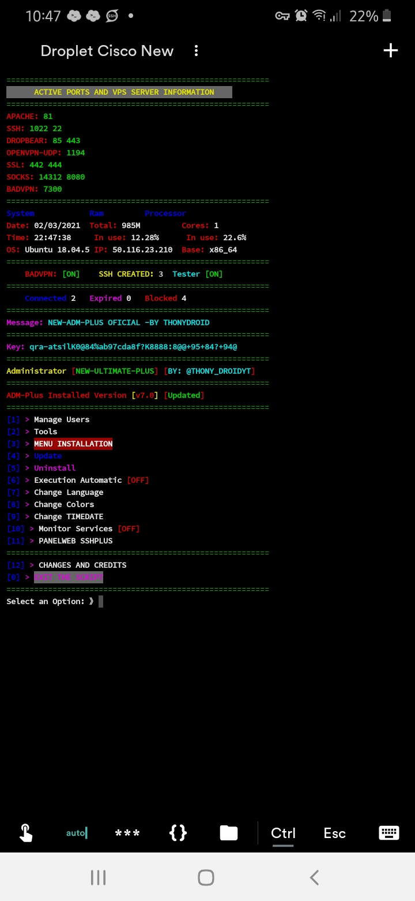

#### Tema 1

## Aplicar Tema 1

bash <(curl -Ls https://www.admplus.tk/themes/tema1.sh)

#### Tema 2

## Aplicar Tema 2

bash <(curl -Ls https://www.admplus.tk/themes/tema2.sh)

#### Tema 3

## Aplicar Tema 3

bash <(curl -Ls https://www.admplus.tk/themes/tema3.sh)

#### Tema 4

## Aplicar Tema 4

bash <(curl -Ls https://www.admplus.tk/themes/tema4.sh)
